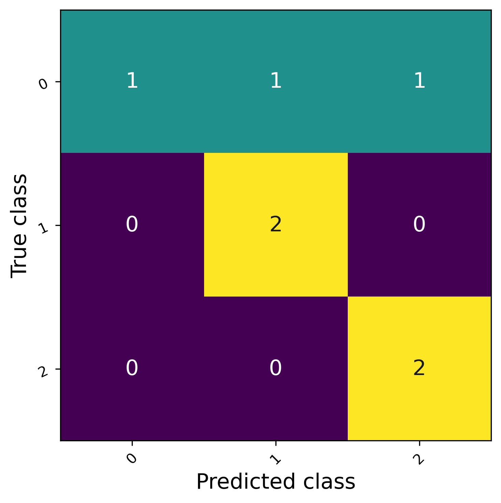

# Skateboard Trick Classifier: CNN vs Video Transformer
An end-to-end computer vision pipeline for classification of skateboard tricks using OpenCV 
and YOLO11. 
 - YOLO pose estimation for the skate and YOLO bounding boxes for the skateboard
   - MediaPipe was tested but didn't perform well in this case.
   - OpenPose is outdated, and HRNet was not need due to YOLO performance
 - Pipeline starts with a temporal CNN (ResNet), with comparison to an optimized ViViT transformer from Hugging Face.

---

## Problem Statement

Classifying skateboard tricks from short videos are challenging due to:
 - camera angles
 - limited data
 - motion blur

This project compares frame-based CNNs vs video transformers under 
lack of data. 

---

## Dataset
 - 30 total skateboard trick videos
 - lengths of clips: 1-2 seconds (29-140 frames per clip)
 - Classes: kickflip, ollie, pop shuv
 - Train/test split done by video not per 32 frame clip to avoid leakage
 - Data augmentations only applied to the training dataset
 - Dataset size constraints are addressed through pretrained models and a little fine-tuning

---

## Processing Videos
 - I used YOLOv11n for detecting humans and boards. 

 - I experimented with two different inputs:
   1. Human pose + skateboard pose 
   2. Skateboard pose
 
   - For the tricks in my dataset, using human pose is unreliable due to 
each skater's style in result makes pose pattens under low training data. Board-only inputs 
reduces variability and provided an increased consistency in classifying the trick. In result, 
for this project I'm using only the board bounding boxes to help with simplicity and classification
quality 

| Input	Model	|Accuracy |	F1 |
|-------------|---------|----|
| Full frame ResNet |	0% |	0% |
| Human pose	ResNet |	+10.66%	| +5.33% |
| Board-only	ResNet |	+31.11%	| +40.66% |
| Board-only	ViViT	 | +36.66% |	+54.79% |

Pipeline:
1. Crop using YOLO board bounding box
2. Pad and resize frames to 224x224
3. Generate clips of 32 frames with a stride of 24

[INPUT HOW THE OUPUT LOOKS compared to the input]

---

## Models Used

 - ResNet(frame-based temporal model) 
 - ViVit(Hugging Face video transformer) with Frozen Parameters
 - Both pretrained models and fine-tuned on the small dataset.
 - Augmentations: horizontal flip, autocontrast

---

## Training 

   - 20 epochs
   - Metrics: Accuracy, F1-Score, Precision, Recall
   - Epoch loss curve

---

## Results

  - ResNet:
    - Accuracy:  0.7778
    - Recall:  0.7778
    - Precision:  0.7778
    - F1:  0.7000
    
     
  - ViViT: 
    - Accuracy:  0.8333
    - Recall:  0.8333
    - Precision:  0.9167
    - F1:  0.8413

    

  - Observations:
    1. data limitations:
       - using only 33 videos 
    2. Human pose variability: 
    3. Temporal vs. spatial modeling
  
  Resnet CNN

  

  ViViT

  

  [Example video]

## Limitations 

 - Small dataset limits the metrics percentages
 - only three trick classes
 - Human pose variability limits classifying increase under low data

---

## Future Goals
  - add more training videos 

  - Expand to more tricks that are more complex to classify (e.g., treflips, heelflips, 
laserflip, 3shuv, body varials, etc.)

---

## Deployment
 - implement a simple fastAPI frontend to allow users to submit a trick video and get feedback
 - Containerize using Docker
 - A simple deploy using AWS

[Fast api visuals]

[Proof of deployment]

---

Error analysisw4
