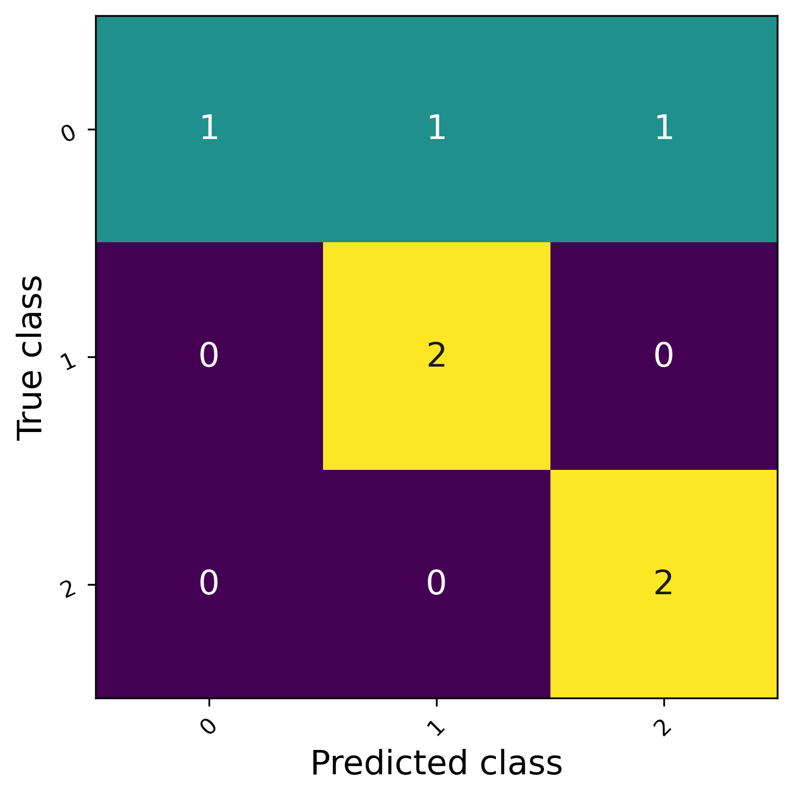
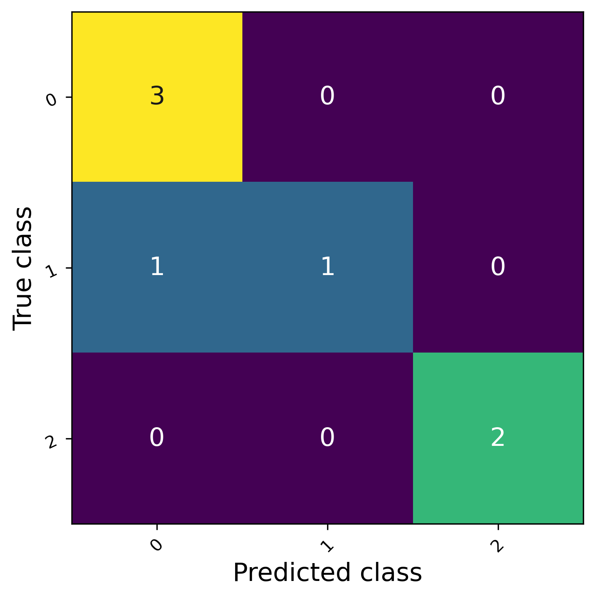
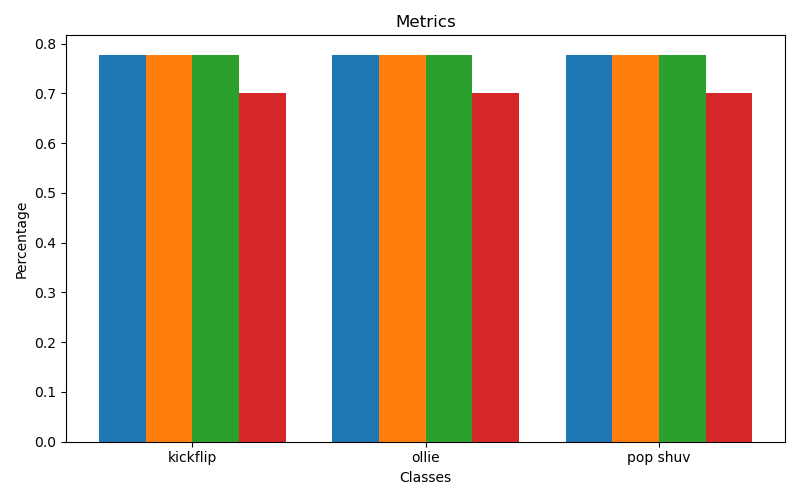
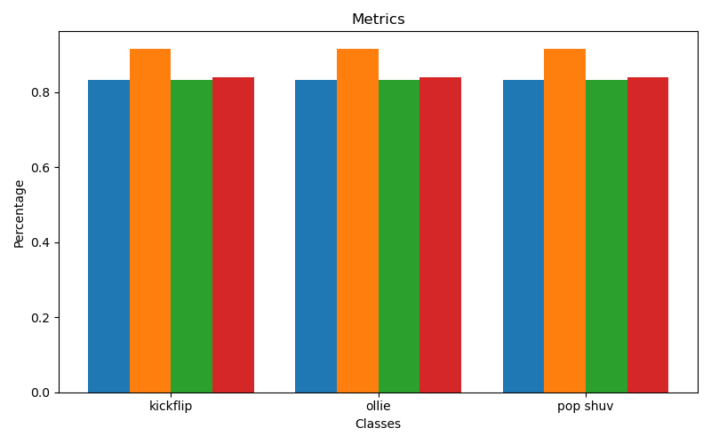

# Low-Data Video Action Recognition: CNNs vs Video Transformers for Skateboard Trick Classifications

This project investigates fine-grained video action recognition **under extreme data 
constraints** (33 labeled videos), a setting common in real-world applications where 
collecting and annotating large video datasets is impractical. I designed and deployed 
an end-to-end pipeline comparing frame-based CNNs and video transformers focusing on 
representation choice, generalization, and deployability rather than fully optimizing for accuracy.

---

## Problem Statement

Classifying skateboard tricks from short videos is challenging due to:
 - camera angle
 - limited data
 - motion blur

This project compares frame-based CNNs vs video transformers under 
lack of data. 

These constraints motivated a focus on pretrained models, minimal fine-tuning, and 
representation choices that reduce inter-skater variability

---

## Dataset
 - 33 total skateboard trick videos
 - lengths of clips: 1-2 seconds (29-140 frames per clip)
 - Classes: kickflip, ollie, popshuv
 - Train/test split done by video not per 32 frame clip to avoid leakage

The dataset size intentionally reflects low-resource, real-world conditions rather than 
benchmark-scale training.

---

## Processing Videos
 - Detection: YOLOv11n for detecting humans and boards. 

 - I experimented with two different inputs:
   1. Human pose + skateboard pose 
   2. Skateboard pose
 
Under limited data, full human pose representations showed high variance due to 
individual skating styles, leading to overfitting. Restricting inputs to skateboard-only 
bounding boxes reduced variability and improved consistency across samples, resulting 
in stronger generalization. 

### Ablation Study

| Input	| Model	  | Accuracy | 	F1     |
|-----------|---------|----------|---------|
| Full frame| ResNet  | 	46.67%  | 	29.34% |
| Human pose| ResNet  | 	57.33%	 | 34.67%  |
| Board-only| 	ResNet | 	77.78%	 | 70.00%  |
| Board-only| 	ViViT	 | 83.33%  | 	84.13% |

Pipeline:
1. Crop using YOLO board bounding box
2. Pad and resize frames to 224x224
3. Generate clips of 32 frames with a stride of 24

[INPUT HOW THE OUPUT LOOKS compared to the input]

---

## Models Used
    
  | Model   | Pretrain      | Frozen Layers                         |
  |---------|---------------|---------------------------------------|
  | ResNet  | resnet18      | None                                  |
  | ViViT   | kinetics-400  | classifier + last two encoder blocks  |
 - ResNet(frame-based temporal model) 
 - ViVit(Hugging Face video transformer) with Frozen Parameters
 - Both pretrained models and fine-tuned on the small dataset.
 - Augmentations: horizontal flip, autocontrast

---

## Training 

   - **Epochs:**
     - **ViViT**: 10
     - **ResNet**: 20
   - **Parameter Freezing:**
     - For ViViT, all layers frozen except:
       - Classifier
       - Last two encoders blocks
   - **Optimizers & Learning Rates**
     - **ViViT (AdamW):**
       - encoder layers (only last two): 0.0001 
       - classifier: 0.0004
     - **ResNet (Adam):** 0.001
   - **Data augmentations:** horizontal flip, autocontrast
   - **Metrics:** Accuracy, F1-Score, Precision, Recall
   - **Tracking loss:** epoch loss curve recording

---

## Results

  - ResNet:
    - Accuracy:  %77.78
    - Recall:  %77.78
    - Precision:  %77.78
    - F1:  %70.00
    
     
  - ViViT: 
    - Accuracy:  %83.33
    - Recall:  %83.33
    - Precision:  %91.67
    - F1:  %84.13

    

  - Observations:
    1. Board-only representations generalize better than human pose under limited data
    2. Video transformers outperform frame-based CNNs in capturing temporal structure
    3. Representation choice had a larger impact than model architecture
  
  ResNet CNN

  

  ViViT

  

  [Example video]

Note: Metrics exhibit variance consistent with small-sample 
evaluation and should be interpreted comparatively rather 
than as absolute performance.

---

## Limitations 

Limitations include a small dataset (33 videos), a limited number of trick classes, and 
sensitivity to camera angle and motion blur. These constraints were accepted to study 
tradeoffs in low-data settings rather than maximize benchmark performance

---

## Future Goals
  
 - cross-skater generalization evaluation
 - robustness to frame dropping
 - latency vs accuracy tradeoffs

---

## Deployment
 - implement a simple fastAPI frontend to allow users to submit a trick video and get feedback
 - Containerize using Docker
 - A simple deploy using AWS

[Fast api visuals]

[Proof of deployment]
